# README FILE

We decided to make a clock-in/clock-out system

Team members:
- Hector Cazares
- Jesus David Nodal
- Chris Reyes

[Google Slides](https://docs.google.com/presentation/d/18uRfRey31XJhuZI4tc-6GPvCoOF6YLPhWeKjRf3ocUE/edit?usp=sharing)

# Use Case Diagram

## The Latest Project Report

# Progress Report 4.0
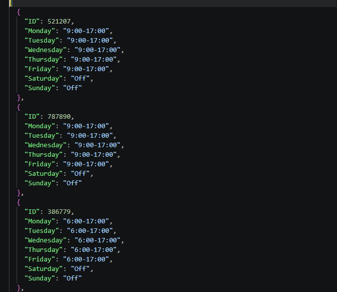
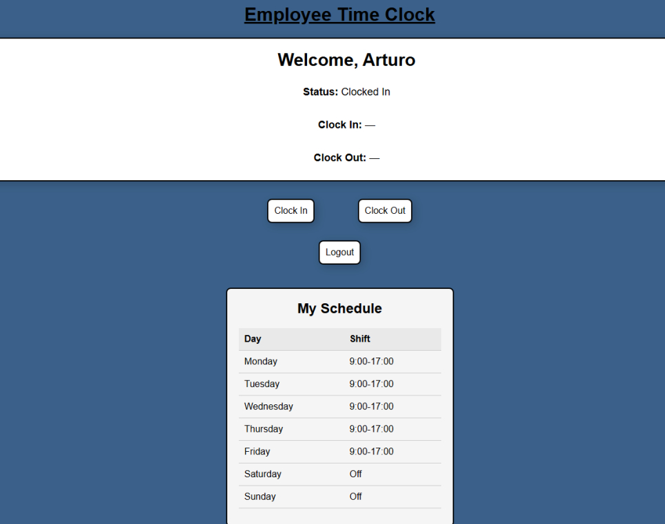
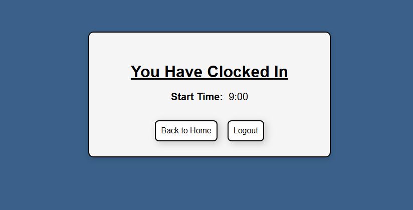
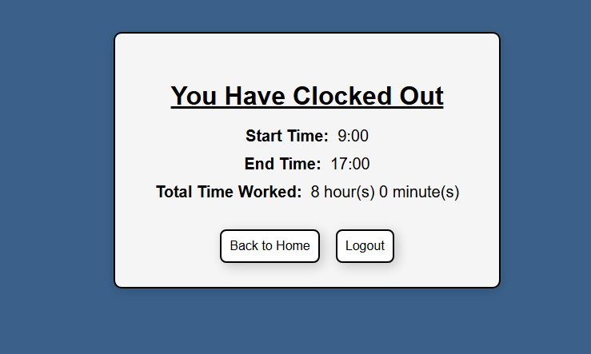

# Progress Report 3.0
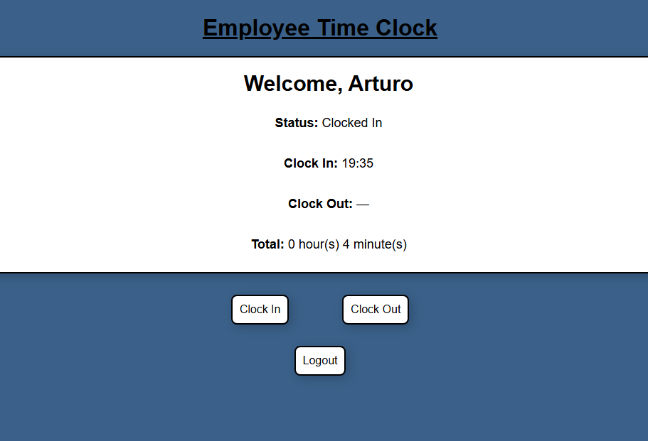
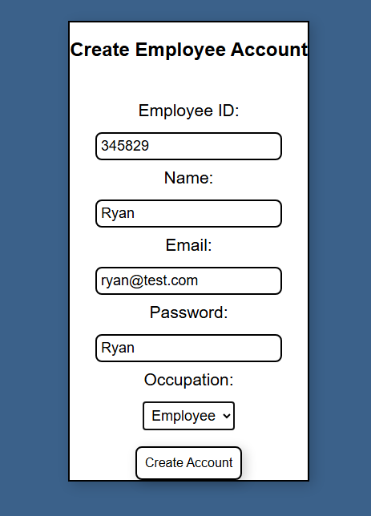
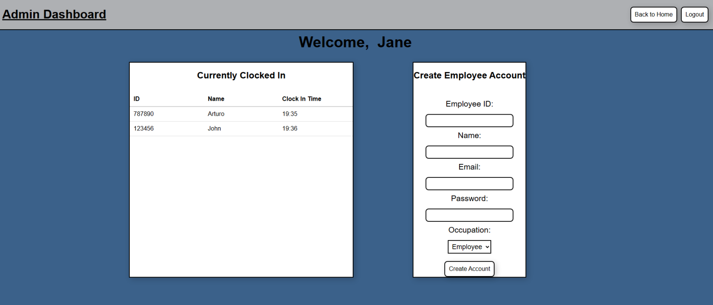
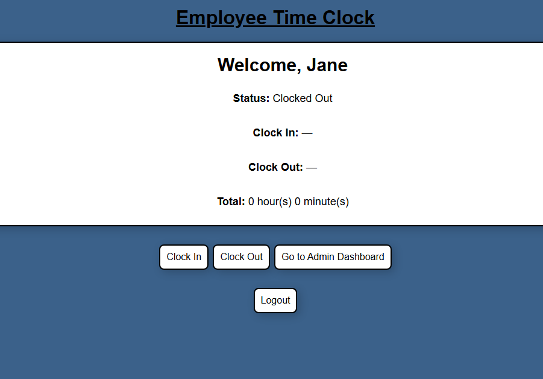
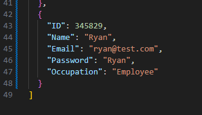
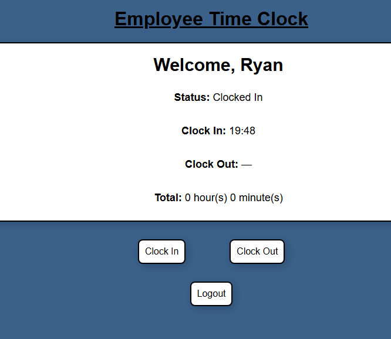

# How the UI looks like so far

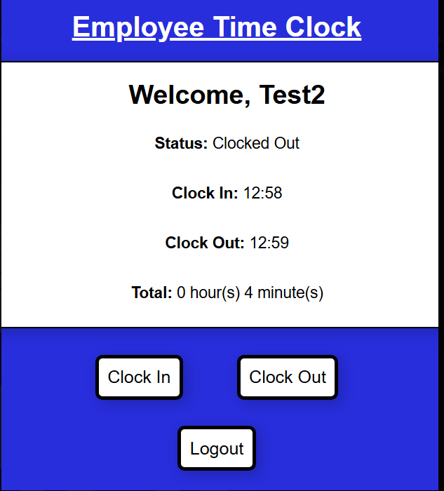
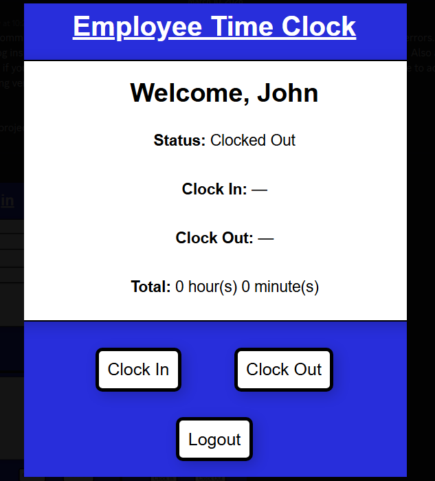
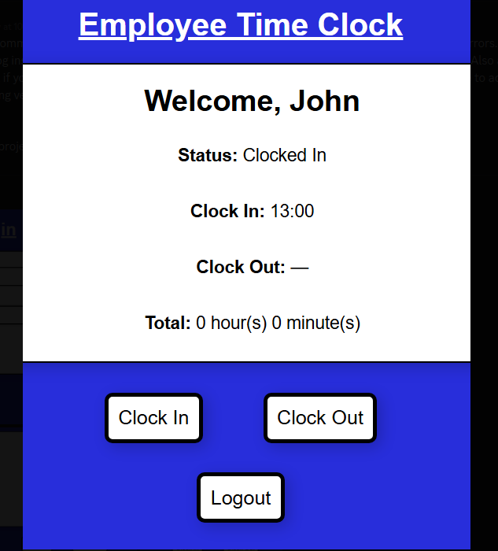
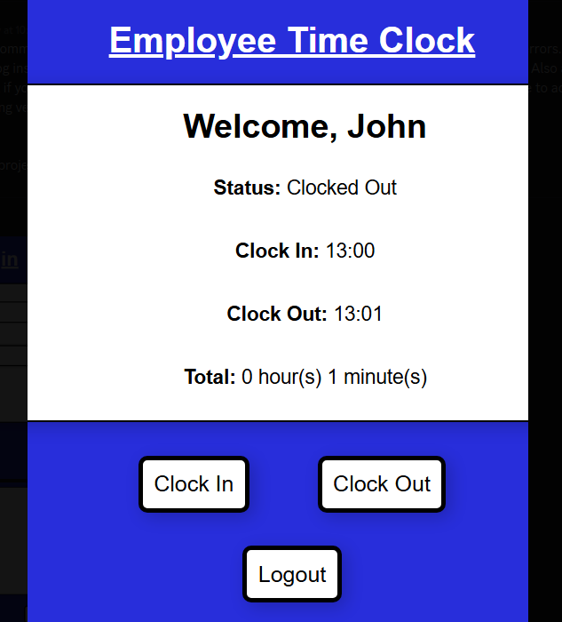

